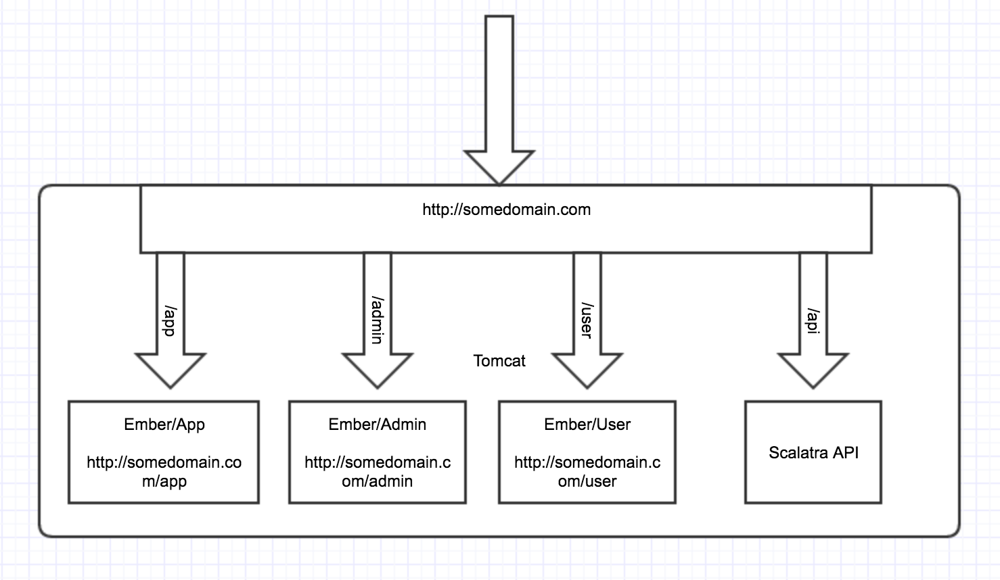
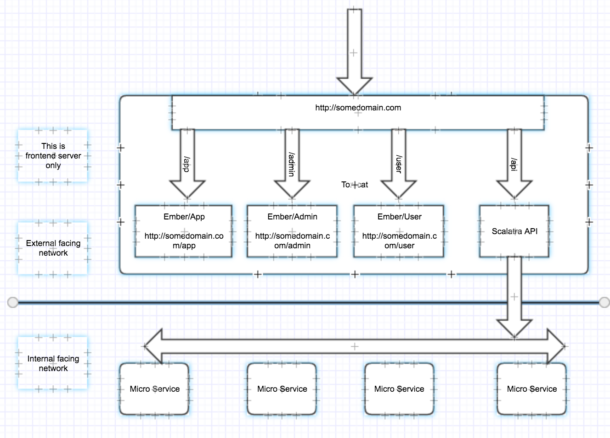

# scalatra-ember-cli-tutorial #
Create a template liked project for using Scala, Scalatra, Ember-cli with multiple projects in one place.

Integration git to trello.
Try again without consumer token

## Goal ##

- A Scalatra web service with fully layering in presentation/domain/data layers.
- Support easy debugging in sandbox environment.
- Integrate Ember.js UI project into Scalatra.
- Enable multiple Ember.js projects live under same domain.
- Multiple Ember.js projects shared same authentication. (Use Ember-simple-auth).
- All these projects can be run under one service in one domain. 
- It is also support flexible to split the project to run as individual services.  

## Structure ##

-- ROOT: The ROOT folder is not a project. It is a content holder for multiple projects. \
-- |-> tiny-legend-web : A scalatra project which provide backend service APIs. \
-- |-> ember-user : Ember application for manage Ember Users authentication. \
-- |-> ember-app : Ember application for main UI. It will use the ember-user's authentication. (Share the user authentication from ember-user project.) \
-- |-> ember-admin : Ember application for admin UI. It will use the ember-user's authentication. (Share the user authentication from ember-user project.) 

## System architecture ##

- Singe thin service architecture

- Multiple services with Micro-Service architecture

- Note:
Use the API service as a gateway to access entire SOA Service system.
 
## How the project be managed ##

- This project will be step by step increasing the function by the git branch number. 
- Each of the branches will start as a integer number and follow with a short name to indicate what function that the branch bring in. 
- Each of later branch is increased from previous branch. But it may has some missing commit if after new branch was created, the previous branch has some bug fixing.
- The finaly result will be merged into master branch. 

## How to use the project ##

- For study purpose, you can follow up the branch number and do it step by step to see each step's topic and understand how it was made. 
It should have its own README.md file as document under [docs](docs/) folder.
- If you just want to use this project, you can clone the master and start to use it.
- You can look at the git commit history to see what was changed in each of branch.

## Contribute to the project ##

- Like other project, you can open the PR and wait to other people to review and merge it.

## License ##

- 100% free for personal or commerce useage.
