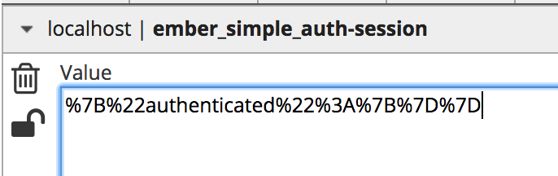
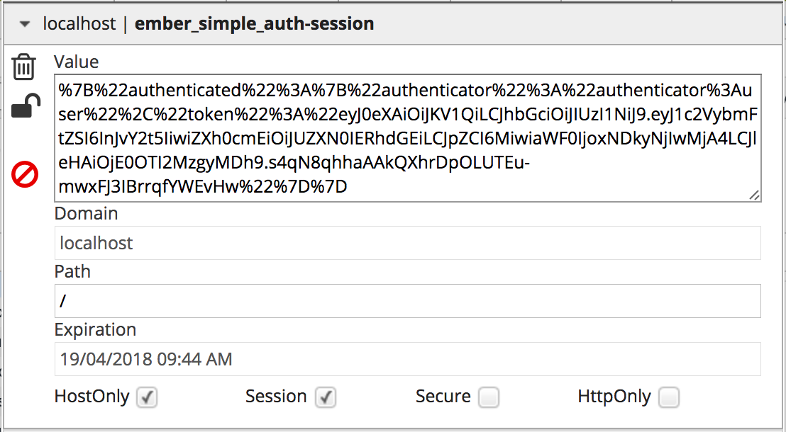
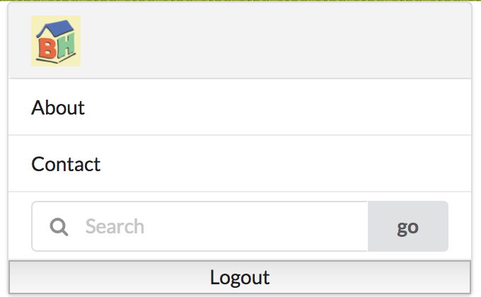

# Share authentication between ember apps #

Now it is most interest part so far for this project. How do we share the user auth so all ember apps under this domain can use it?
 
## Authentication steps ##

As we did in user authentication, I would like to separate it into two steps:

- Read session for user auth token and decided if user is logged-in or not.

- Login user: contact remote authentication server to get user token.

I expect we should do first step.
 
## Add user session support in ember-app ##
- Install ember-simple-auth to ember-app and ember-admin
```aidl
$ember install ember-simple-auth
```
- Create application controller
```aidl
// ember-app
$ ember g controller application
```

- Then add session in it.
```aidl
// ember-app/app/controllers/application.js
import Ember from 'ember';

export default Ember.Controller.extend({
  session: Ember.inject.service('session')
});

```

- Now in template of application.hbs, add check for user login.
```aidl
// ember-app/app/templates/application.hbs

    {{#if session.isAuthenticated}}
      <button {{action 'logout'}}>Logout</button>
    {{else}}
      <button {{action 'login'}}>Login</button>
    {{/if}}
    
```

- Since we use action, let's create application.js route and add actions
```aidl
// ember-app/routes/application.js
import Ember from 'ember';
import ApplicationRouteMixin from 'ember-simple-auth/mixins/application-route-mixin';
export default Ember.Route.extend(ApplicationRouteMixin, {
  actions: {
    logout: function() {
      this.get('session').invalidate();
    },
    login: function() {
      window.location.replace("/user/");
    }
  }
});

```

### Let's test it ###

- Login to http://localhost:8080/user, I can see 'logout' button. I was logged in.
- Switch to http://localhost:8080/app. I see in the menu bar, it show **'login'**.

Does not work yet. What was happened?

- Yep, after check the cookie, it did not looks like has full authentication token in the cookie yet.
 See following image. The cookie is too short.
 


- By default ember use local storage store for session. It is not sharable between embers. Let's add cookie store.
Following by this doc: [CookieStore](https://ember-simple-auth.com/api/classes/CookieStore.html)

Important thing is session-stores, we need add CookieStore so ember will use it. We need to do it in **_all Ember apps_**.

```aidl
$ cd app
$ mkdir session-stores
$ touch application.js
```
Then let's modify the code /app/session-stores/application.js
```aidl
// app/session-stores/application.js
import CookieStore from 'ember-simple-auth/session-stores/cookie';

export default CookieStore.extend();
```

### Rebuild all ember apps. ###
 Run `ember build` for all ember apps.
 
### Let's test it again ###

- Login to http://localhost:8080/user, I can see 'logout' button. I was logged in.
- Switch to http://localhost:8080/app. I see in the menu bar, it show **'login'**.

Still does not work! But good is I see the auth cookie in both /user and /app. A little progress.
 


Now what is next?

### Restore session from cookie ###

Read ember-user authenticators/user.js, it has a method 'restore'. 

Read document [BaseAuthenticator](https://ember-simple-auth.com/api/classes/BaseAuthenticator.html), it has following statement.

```aidl
The authenticator also decides whether a set of data that was restored from the session store (see restore) makes up an authenticated session or not.
```

Guess what was happened, the /app should restore the user auth from cookie store in order to get session token. So we should add authenticator to make it.

In ember-app, add app/authenticator/user.js

```aidl
$ ember g authenticator user
```

Let's see what is default:
```aidl
import Base from 'ember-simple-auth/authenticators/base';

export default Base.extend({
  restore(data) {
  },

  authenticate(/*args*/) {
  },

  invalidate(data) {
  }
});

```

We only want to restore the token for now, so update the restore method:
```aidl
restore: function(data) {
    return new Ember.RSVP.Promise(function(resolve, reject) {
      if (!Ember.isEmpty(data.token)) {
        resolve(data);
      } else {
        reject();
      }
    });
  },
```

### Let's test it one more time ###

- Login to http://localhost:8080/user, I can see 'logout' button. I was logged in.
- Switch to http://localhost:8080/app. I see in the menu bar, it show **'logout'** !

Woo. We got it works!



## Logout ##

Now we need user could log out from anywhere.

- Solution 1: in each of app authenticator/user.js, implement invalidate method.
- Solution 2: redirect url to /user/#/logout

I will do solution 1. since we anyway need to write `restore` method, it is not hurt to fill `invalidate` method with a couple of lines.

This is the full version for the authenticator/user code.
```aidl
import Ember from 'ember';

import Base from 'ember-simple-auth/authenticators/base';

export default Base.extend({
  restore: function(data) {
    return new Ember.RSVP.Promise(function(resolve, reject) {
      if (!Ember.isEmpty(data.token)) {
        resolve(data);
      } else {
        reject();
      }
    });
  },

  authenticate(/*args*/) {
  },

  invalidate: function() {
    console.log('invalidate...');
    return Ember.RSVP.resolve();
  }
});

```

## Update admin to enable authentication as well ##

Enable the admin auth check. Also added home page menu, index, product, sale routes etc.


## About other apps under same domain ##

Other than these Ember APPs, other apps also can get same auth cookie as well.

To enable the authentication be shared for other APPs (No Ember Apps), such as Scatra Api, or Java API etc, 
Since the cooke was send in every request, so as long as other apps could understnad the cookie, then it should be able to use the JWT token.

Ember also have another authorize could construct cookie for API call. This will be discussed in other topic.